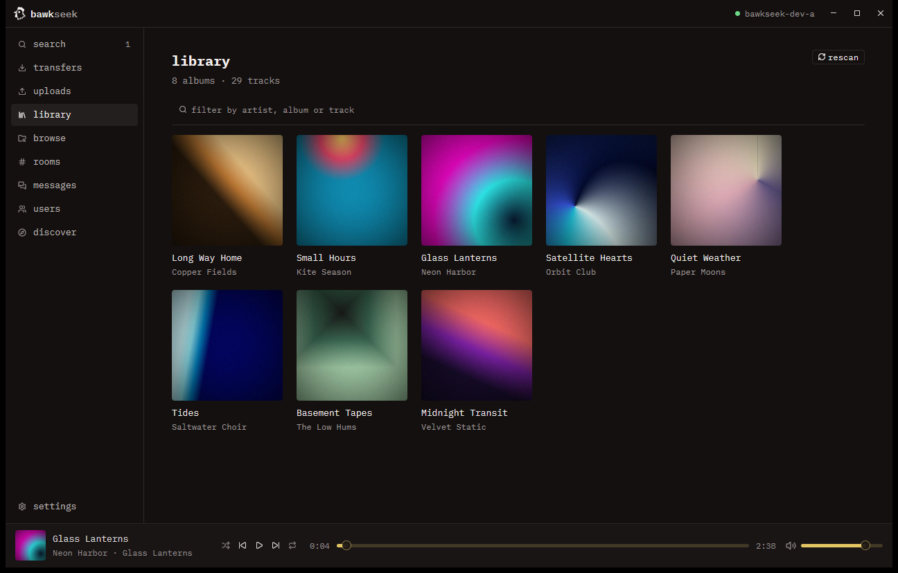
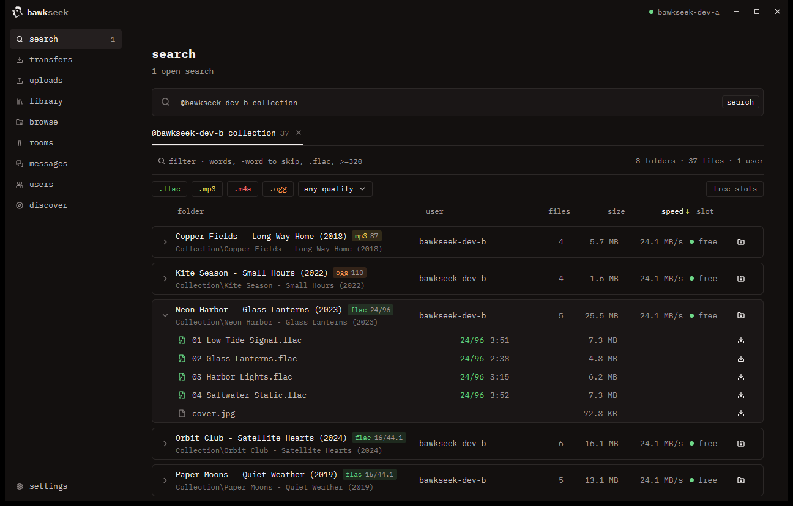
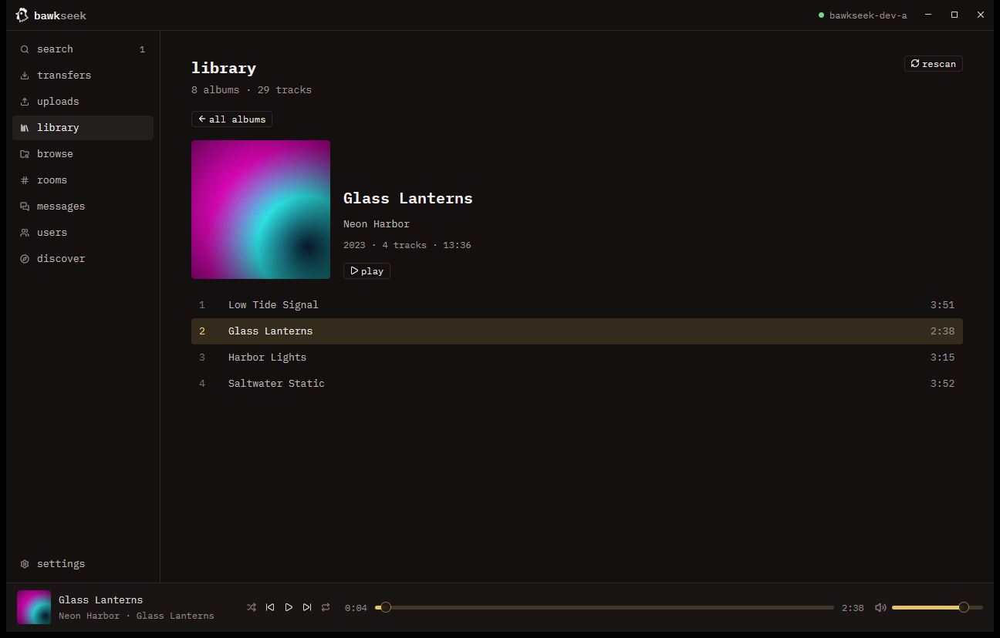
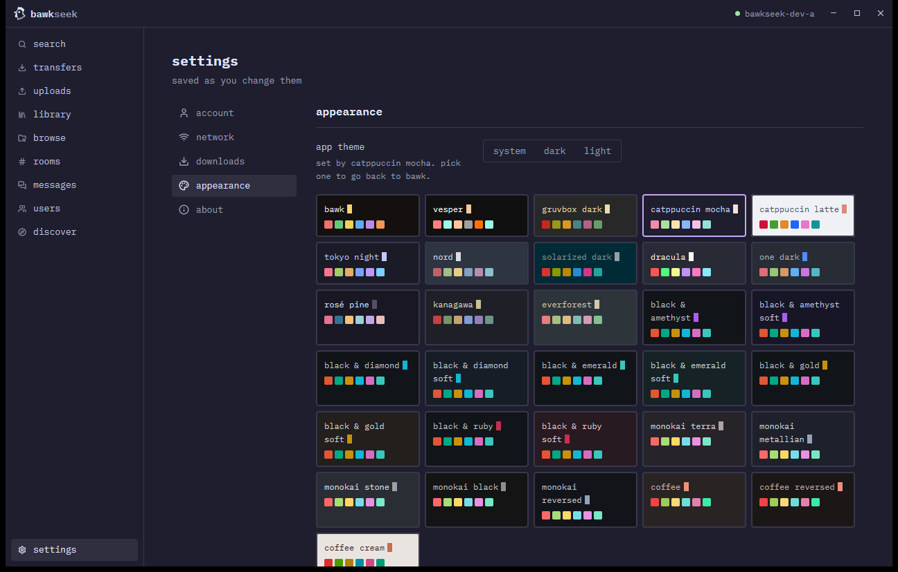

# bawkseek

[](https://github.com/juddisjudd/bawkseek/releases/latest)
[](https://github.com/juddisjudd/bawkseek/releases)
[](https://github.com/juddisjudd/bawkseek/actions/workflows/release.yml)
[](#1-download)
[](LICENSE)

bawkseek is a Windows app for [Soulseek](https://www.slsknet.org), the long-running network where people share music straight from their own computers. Search everyone's shared folders, download whole albums, chat, and play your music in the built-in player.


https://github.com/user-attachments/assets/67453641-9514-4e91-af93-beb7d8943074




## Get started

### 1. Download

1. Open the [releases page](https://github.com/juddisjudd/bawkseek/releases) and download the newest `bawkseek-…-windows-x64.zip`.
2. Unzip it anywhere, for example into `Documents\bawkseek`.
3. Double-click `bawkseek.exe`. There is nothing to install.

You need Windows 10 or 11, 64-bit.

**"Windows protected your PC"?** bawkseek is not signed with a paid certificate yet, so Windows may warn you the first time. Click **More info**, then **Run anyway**.

**A firewall prompt?** Click **Allow**. Other people need to reach you to download what you share and to send you search results.

### 2. Log in

Pick a name and a password. If nobody has that name yet, the server makes the account for you.

Write the password down. Soulseek has no "forgot password", so a lost password means a lost name. Tick **remember me** to stay logged in. The password is kept in Windows Credential Manager.

### 3. Share some music

Open **uploads** and add the folders you want to share. Soulseek only works because people share, and many users won't let you download from them if you share nothing.

Other people see each shared folder by its name only: `D:\Music` shows up as `Music`.

### 4. Find and download

Type an artist, album or song on the **search** page and press Enter. Results keep arriving for about half a minute, grouped by folder. Click the folder button to download a whole album, or open a folder and pick single files.

Your downloads go to `Downloads\bawkseek`, one folder per album. You can change the folder under **settings**.

### 5. Listen

Open **library** to see your downloads and shared folders as albums with their covers. Sort them by **artist**, **album**, **recently added** or **folder**; artist and folder sorts group the albums under headings. Click an album, then **play**. The player stays at the bottom while you browse, with shuffle, repeat, a seek bar and volume. Press **space** to play or pause.

### 6. Stay up to date

bawkseek checks for a new version each time it starts. When one is out, you get a notification and a dot on **settings → about**. Press **update**, then **restart now**. Your settings and downloads stay as they are.

## Everything it does

- **Search** with live results, sorted by speed, user, size or name. Each audio format has its own color: green for FLAC, yellow for MP3, and so on. Filter by format and quality, or show only users with a free slot.
- **Downloads** of single files or whole folders, subfolders included. Pause, resume, retry, cancel, and play a finished file straight from the list.
- **Wishlist:** press **keep searching** on a search and it runs again by itself every so often. You get a notification when something new turns up.
- **Browse** anyone's shared folders as a tree, and download from there.
- **Messages:** private chats, saved on your computer.
- **Rooms:** join public chat rooms, make private ones, or follow every room at once.
- **Users:** look anyone up, keep a buddy list with online status, and ignore people. An ignored user's messages are hidden, and they can't download from you or browse your files.
- **Discover:** add artists and genres you like and get recommendations and people with similar taste.
- **Library and player** for MP3, FLAC, M4A/AAC, ALAC, OGG Vorbis, WAV and AIFF. Opus, WMA, APE and WavPack don't play yet. An album found in two folders, such as a download you also share, shows up once.
- **Themes:** dark, light, follow Windows, or one of 30 named themes such as gruvbox, catppuccin, tokyo night, nord and dracula.
- **Notifications** for new messages, finished albums and new wishlist results, also in the Windows notification center.
- **Reconnects** by itself when the connection drops, and rejoins your rooms.
- **Updates** itself from the releases page. Each download is checked against its SHA-256 checksum before it is installed.

## A closer look

**Search** groups results by folder and colors each format, so a 24-bit FLAC album stands out from a 128 kbps MP3 at a glance.



**Albums** open to their track list. Click any track to start playing from there.



**Themes:** pick from 30, or let bawkseek follow Windows between dark and light.



## Search tips

| Type | To get |
| --- | --- |
| `boards of canada geogaddi` | folders with all of those words |
| `geogaddi -live` | leave out anything with "live" |
| `@someuser flac` | search one user's files only |
| `#"The Lobby" jazz` | search the people in one chat room |

The filter box under the results narrows them down without searching again:

| Type in the filter | To keep |
| --- | --- |
| `.flac` | FLAC files only (the format buttons do this too) |
| `>=320` or `≥320` | files of 320 kbps or more |
| `<256` | files under 256 kbps |
| `-remix` | anything without "remix" |

Lossless files count as higher than any MP3 bitrate.

## When something doesn't work

**Hardly anyone can download from me, or I get few results.** Other people must be able to connect to you on port 2234. bawkseek asks your router to open it automatically (UPnP). **settings → network** shows whether that worked. If it says no router answered, open TCP port 2234 to your PC in your router's settings ("port forwarding"), and allow bawkseek through the Windows firewall.

**"Could not listen on port 2234".** Another program, often another Soulseek app, is using the port. Close it, or pick another listening port under **settings → network**. The new port takes effect the next time you log in.

**"You logged in from somewhere else".** The same account was logged in on another computer or app, so the server closed this session. Close the other one, then press **log in here again** in the banner.

**A song won't play.** Check that it's one of the formats listed above. Files that are still downloading or broken can't play either.

**The library is missing new music.** It rescans by itself shortly after downloads finish. For music you added some other way, press **rescan** on the library page.

**An update fails with "cannot write next to bawkseek.exe".** bawkseek is in a folder it can't change, such as `Program Files`. Move the bawkseek folder somewhere of your own, such as `Documents`, or download the new zip by hand.

## Where your things are

| What | Where |
| --- | --- |
| Downloads | `Downloads\bawkseek` (change it under settings) |
| Settings, shared folders, buddies | `%APPDATA%\bawkseek\config.json` |
| Chat history and wishlist | `%APPDATA%\bawkseek\messages` and `\wishlist` |
| Library cache and cover thumbnails | `%APPDATA%\bawkseek\library.json` and `\covers` |
| Saved password | Windows Credential Manager, under `bawkseek` |

To start fresh, close bawkseek and delete the `%APPDATA%\bawkseek` folder.

## For developers

bawkseek is written in Rust with [GPUI Kit](https://gpui-kit.com). It speaks Soulseek through its own protocol crate in [`crates/slsk`](crates/slsk).

### Build from source

You need:

1. Rust 1.92 or later, with the MSVC toolchain.
2. Visual Studio 2022 Build Tools with the **Desktop development with C++** workload.
3. CMake on `PATH`.

Then:

```sh
cargo run --release       # build and start
cargo test --workspace    # run the tests
```

The first build compiles GPUI and takes a few minutes.

To see the network traffic, set two environment variables before you start it:

```powershell
$env:LOG_LEVEL = "DEBUG"; $env:LOG_FILE = "$env:TEMP\bawkseek.log"; cargo run
```

Set `BAWKSEEK_HOME` to a folder to keep a second copy's settings apart from your own.

### Make a release

The version lives in `Cargo.toml`. To publish a new one, run this from a clean `main`:

```powershell
.\scripts\release.ps1 -Version 0.2.0
```

It sets the version, commits, tags `v0.2.0` and pushes. The [release workflow](.github/workflows/release.yml) then tests, builds and publishes the zip and its SHA-256 checksum on the releases page, with notes that GitHub generates. A tag that doesn't match the version in `Cargo.toml` fails the build.

## Credits

- [slsk](crates/slsk), bawkseek's own Soulseek protocol crate, built from the [Nicotine+ protocol notes](https://github.com/nicotine-plus/nicotine-plus/blob/master/doc/SLSKPROTOCOL.md) and [soulseek-rs](https://github.com/michel/soulseek-rs) (MIT).
- [GPUI Kit](https://github.com/longbridge/gpui-kit) (Apache-2.0) and Zed's GPUI draw the interface.
- [rodio](https://github.com/RustAudio/rodio) and [Symphonia](https://github.com/pdeljanov/Symphonia) play the music. [Lofty](https://github.com/Serial-ATA/lofty-rs) reads the tags.
- [IBM Plex Mono](https://github.com/IBM/plex) (SIL Open Font License, `assets/fonts/OFL.txt`) is the typeface.
- [Lucide](https://lucide.dev) (ISC) icons.

Please share back what you download.

## License

[AGPL-3.0](LICENSE).
